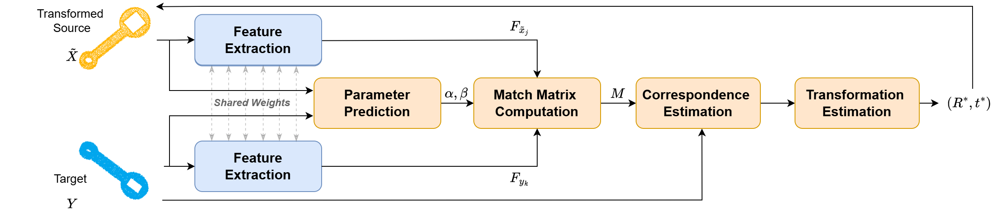
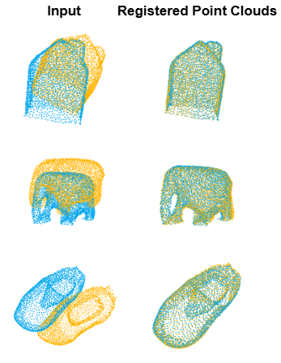
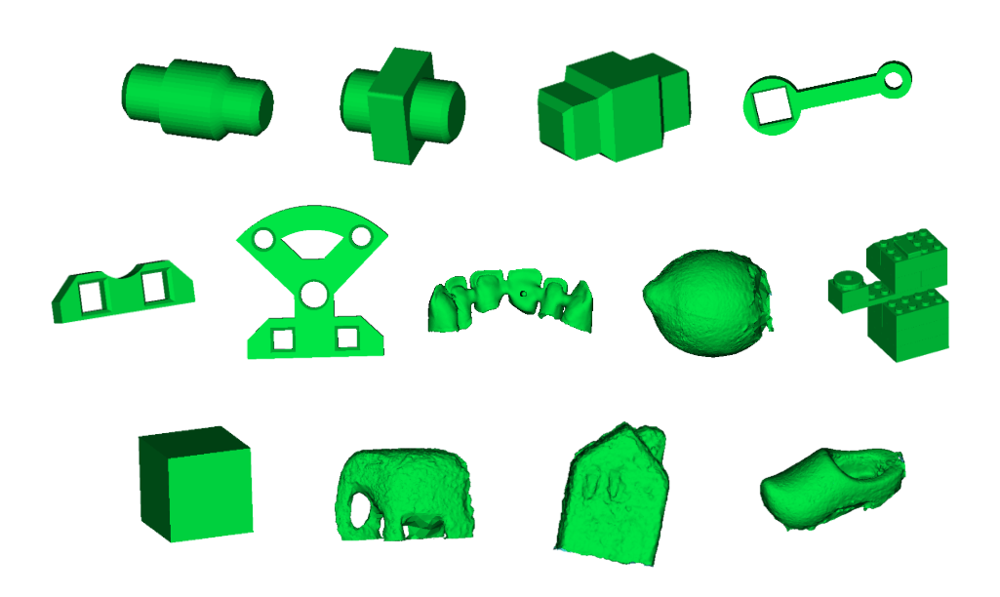
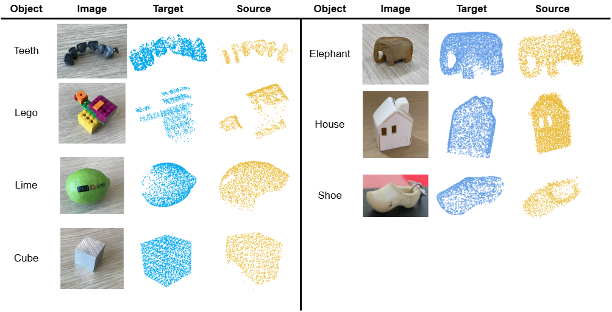
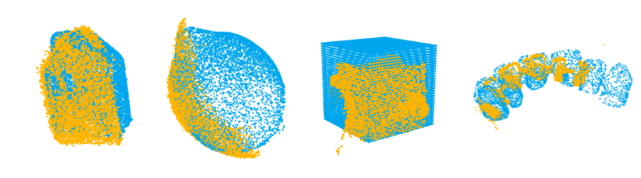

<!-- # R3PM-Net


This repository contains the official implementation of the paper:

<p align="center">
  <strong><a href="https://arxiv.org/abs/2604.05060">R3PM-Net: Real-time, Robust, Real-world Point Matching Network</a></strong><br>
  <strong>(AI4RWC@CVPRW 2026 - Oral Presentation)</strong>
</p> -->

<p align="center">

  <h1 align="center">R3PM-Net: Real-time, Robust, Real-world Point Matching Network</h1>
<p align="center"> <strong>AI4RWC@CVPRW 2026 - Oral Presentation</strong></p>
  <h3 align="center"><a href="https://arxiv.org/abs/2604.05060">Paper</a> | <a href="https://yasiikb.github.io/R3PM-Net/">Project Page</a> | <a href="https://huggingface.co/datasets/YasiiKB/R3PM-Net">Dataset</a></h3>
  <div align="center"></div>
</p>
<p align="center">  </p>
<p align="left"><i>Figure 1. Overview of the R3PM-Net Architecture. R3PM-Net employs a global-aware feature extraction module with shared weights to learn geometric similarities across a full receptive field.</i></p>

## Introduction

R3PM-Net is a lightweight, global-aware, object-level point matching network designed to bridge the gap between approaches trained and evaluated on clean, dense, synthetic and real-world industrial point cloud data by prioritizing both generalizability and real-time efficiency.

<p align="center">  </p>
<p align="left"><i>Figure 2. Examples of R3PM-Net performance on the Sioux-Cranfield dataset.</i></p>

### Datasets

We propose two datasets; **Sioux-Cranfield** and **Sioux-Scans**, to address the gap between synthetic datasets and real-world industrial data.

<p align="center">
  <table>
    <tr>
      <td align="center">
        
        <br>
        <sub><b>Sioux-Cranfield</b></sub>
      </td>
      <td align="center">
        
        <br>
        <sub><b>Sioux-Scans</b></sub>
      </td>
    </tr>
  </table>
</p>
<p align="left"><i>Figure 3. CAD models of the Sioux-Cranfield dataset (Left). The first six belong to the Cranfield Assembly benchmark and the rest are contributions of this paper (Sioux dataset). Sioux-Scans point cloud data (Right). Target (blue) and Source (yellow) point clouds for seven distinct objects.</i></p>

## Environment Setup

```bash
# 1. Create environment
conda env create -f environment.yml
conda activate r3pm_net

# Optionally, install the dependencies and run manually:
pip install -e .
```

To run the evaluations, please refer to each method's repo to set up the environment:
[Predator](https://github.com/prs-eth/OverlapPredator),
[GeoTransformer](https://github.com/qinzheng93/geotransformer),
[LoGDesc](https://github.com/karim416/LoGDesc), and 
[RegTR](https://github.com/yewzijian/regtr).

Everything must be installed into the **same** conda enviromnet.

## Data Preparation

### ModelNet40

Download the dataset from [ModelNet40](http://modelnet.cs.princeton.edu/ModelNet40.zip) and extract it to:

```
data/ModelNet40
```

To save time, download the downsampled ModelNet40 test set from [ModelNet40_Downsampled](https://huggingface.co/datasets/YasiiKB/R3PM-Net/blob/main/down_sampled_modelnet40.zip) and put it in:

```
data/down_sampled_modelnet40
```

### Sioux-Cranfield

Download the dataset from [Sioux_Cranfiled](https://huggingface.co/datasets/YasiiKB/R3PM-Net/blob/main/sioux_cranfield.zip) and put it in:

```
data/sioux_cranfield
```

### Sioux-Scans

Download the dataset from [Sioux_Scans](https://huggingface.co/datasets/YasiiKB/R3PM-Net/blob/main/sioux_scans.zip) and put it in:

```
data/sioux_scans
```

### Fine-tune 

Download the pickle files (.pkl) from [here](https://huggingface.co/datasets/YasiiKB/R3PM-Net/blob/main/simulators.zip) and put them in:

```
data/simulators
```
These pickle files are created from a subset of the Sioux-Cranfield containing the "teeth", "cube", "lime" and "lego" CAD models. There are 320 point cloud pairs, with 80-20 train-test split. 

Optionally, to create your own datasets, use the scripts in `dataloader`, refering to the README file in that directory.

## Pre-trained Models

Please download the pretrained model of each method from their repo (links provided above) and follow their instructions as to where to put them.

We use RPMNet's pre-trained model (*clean-trained*) for our Zero-shot version. Download it from [here](https://github.com/vinits5/learning3d/tree/master/pretrained/exp_rpmnet/models) and put it in:

```
checkpoints/
```

*Note:* You need to fine-tune the model yourself (see bleow) to get the fine-tuned weights which then you can put in the same directory. 

## Folder Structure

```text
r3pm_net/
├── assets/                     
├── config/
│   ├── default.yaml            # Training defaults
│   └── eval.yaml               # Paths for evaluation scripts
├── checkpoints/                # Pre-trained models' weights     
├── data/                       
│   ├── down_sampled_modelnet40/
│   ├── ModelNet40/
│   ├── sioux_cranfield/
│   └── sioux_scans/
├── dataloader/                 # Dataset dict generation & loaders
├── logs/                       # Experiment logs
├── r3pm_net/                   # Core package (model, feature extractor, config)
├── scripts/                    # SLURM/Bash and evaluation scripts
│   ├── eval_modelnet40.py
│   ├── eval_sioux_cranfield.py
│   ├── eval_sioux_scans.py
│   ├── modelnet40.sh
│   ├── sioux_cranfield.sh
│   └── sioux_scans.sh
├── src/
│   └── train.py                # Training 
├── thirdparty/learning3d/      # learning3d (RPMNet, losses, ops, …)
├── tools/                      # Registration eval, metrics, visualization
├── environment.yml 
├── pyproject.toml
└── README.md
```

## Train 

To train the model using `data/simulators` or your own dataset run:
```bash
python src/train.py
```

## Evaluation

Scripts are provided in `scripts/` to reproduce results.

**ModelNet40**

```bash
bash scripts/modelnet40.sh
```

**Sioux-Cranfield**

```bash
bash scripts/sioux_cranfield.sh
```

**Sioux-Scans**
This evaluates the proposed hybrid Coarse-to-Fine Registration approach.

```bash
bash scripts/sioux_scans.sh
```

### Manual Execution

For example for evaluation on `Sioux-Cranfield`, run:

```bash
python scripts/eval_sioux_cranfield.py
```

## Results
*IMPORTANT NOTE: Unfortunately, we cannot release the feature-extraction model and the fine-tuned weights. Therefore, to re-poduce these results you need to implement the feature extractor (based on the paper) and fine-tune it with the provided data.*

### ModelNet40


| Method              | RRE [°] ↓         | RTE [cm] ↓        | CD [cm] ↓         | Fitness ↑         | In. RMSE [cm] ↓ | Time [s] ↓        |
| ------------------- | ----------------- | ----------------- | ----------------- | ----------------- | ------------------ | ----------------- |
| RPMNet              | 30.898    | **0.002** | 0.153     | *0.998* | 0.094      | *0.021* |
| Predator            | 7.262      | 0.028 | *0.045* | **1.000** | *0.026*  | 0.071      |
| GeoTransformer      | 50.357 | 0.215 | 0.255 | 0.921 | 0.101 | 0.065 |
| RegTR               | **1.712** | *0.007* | **0.017** | **1.000** | **0.009**  | 0.045     |
| LoGDesc             | 42.762 | 0.158 | 0.183 | 0.978 | 0.097 | 0.075     |
| **R3PM-Net (ours)** | *5.198* | 0.010   | 0.052     | **1.000** | 0.029      | **0.007** |


> **Notes:** **Best** results are in bold; *Second-best* results are underlined.

### Sioux-Cranfield


| Method              | RRE [°] ↓         | RTE [cm] ↓        | CD [cm] ↓         | Fitness ↑         | In. RMSE [cm] ↓ | Time [s] ↓        |
| ------------------- | ----------------- | ----------------- | ----------------- | ----------------- | ------------------ | ----------------- |
| RPMNet              | 32.217    | **0.002** | 0.160   | *0.997* | 0.098 | 0.021  |
| Predator            | 16.448    | 0.044     | 0.072   | **1.000** | 0.042      | 0.071     |
| GeoTrans.           | 45.582    | 0.183     | 0.297   | 0.906     | 0.111       | 0.065     |
| RegTR               | **1.311** | *0.004* | **0.023** | **1.000** | **0.012**  | 0.045   |
| LoGDesc             | 121.224 | 0.773    | 0.692   | 0.718     | 0.224 | 0.075     |
| **R3PM-Net (ours)** | *5.451* | 0.006 | *0.054* | **1.000** | *0.030*  | **0.006** |


### Sioux-Scans
<p align="center">  </p>

<p align="left"><i>Figure 4. Qualitative registration results of R3PM-Net on real-world event-camera data. It successfully aligns the "teeth" and "cube" models. The fine-tuned version also solves the "lime" and "house".</i></p>

## Acknowledgement

We adapted some codes from some awesome repositories including [Learning3D](https://github.com/vinits5/learning3d) and [RPMNet](https://github.com/yewzijian/RPMNet). Thanks for making the codes publicly available.

## Citation

If you find this repository useful, please consider citing:

```bibtex
@misc{kashefbahrami2026r3pmnetrealtimerobustrealworld,
      title={R3PM-Net: Real-time, Robust, Real-world Point Matching Network}, 
      author={Yasaman Kashefbahrami and Erkut Akdag and Panagiotis Meletis and Evgeniya Balmashnova and Dip Goswami and Egor Bondarau},
      year={2026},
      eprint={2604.05060},
      archivePrefix={arXiv},
      primaryClass={cs.CV},
      url={https://arxiv.org/abs/2604.05060}, 
}
```

